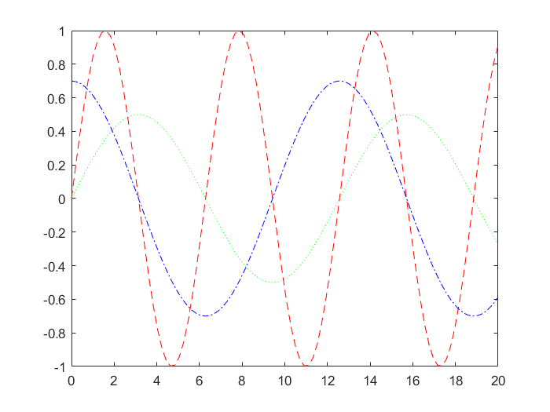
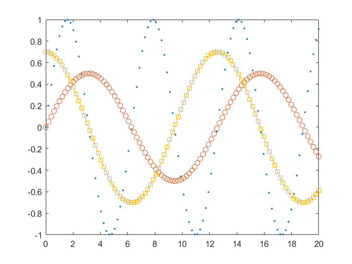
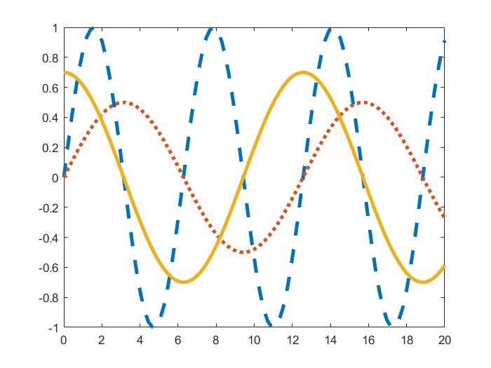
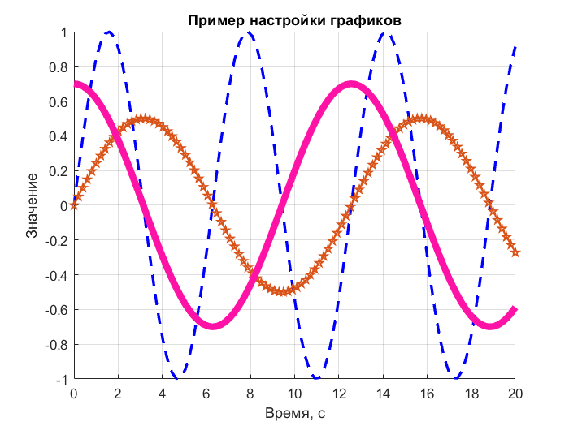

# Оформление графиков

### Важно: рекомендуем посмотреть пример в [PDF](setup_plot.pdf), а также изучить [дополнительные материалы](#дополнительно)

**Базовые возможности изменения вида графиков**

Задание типа и цвета линии

```matlab:Code
t = linspace(0, 20, 100);
s1 = sin(t);
s2 = 0.5 * sin(0.5 * t);
s3 = 0.7 * sin(0.5 * t + pi/2);
figure
plot(t, s1, '--r', t, s2, ':g', t, s3, '-.b')
```



Включение маркеров точек

```matlab:Code
plot(t, s1, '.', t, s2, 'o', t, s3, '-s')
```



Задание толщины всех линий

```matlab:Code
plot(t, s1, '--', t, s2, ':', t, s3, 'LineWidth', 3)
```



Задание толщины и других настроек каждой линии

```matlab:Code
figure
hold on
plot(t, s1, '--b', 'LineWidth', 2)
plot(t, s2, '-p', 'LineWidth', 1)
plot(t, s3, 'LineWidth', 5, 'Color', '#ff13a6')
hold off
```

Включение сетки

```matlab:Code
grid on
```

Настройка подписей

```matlab:Code
title('Пример настройки графиков')
xlabel('Время, с')
ylabel('Значение')
```



# Дополнительно

[Больше примеров с оформлением графиков](https://docs.exponenta.ru/matlab/examples.html?category=formatting-and-annotation#formatting-and-annotation) [[english](https://www.mathworks.com/help/matlab/examples.html?category=formatting-and-annotation)]

[Подробнее об оформлении графиков в MATLAB](https://docs.exponenta.ru/matlab/formatting-and-annotation.html) [[english](https://www.mathworks.com/help/matlab/formatting-and-annotation.html)]

[Визуализация данных (видео)](https://youtu.be/BZXTysdoC7I)

[Расширенное построение графиков (видео)](https://youtu.be/rH8kiCK_aUQ)

[Библиотека графиков от MathWorks](https://www.mathworks.com/products/matlab/plot-gallery.html)