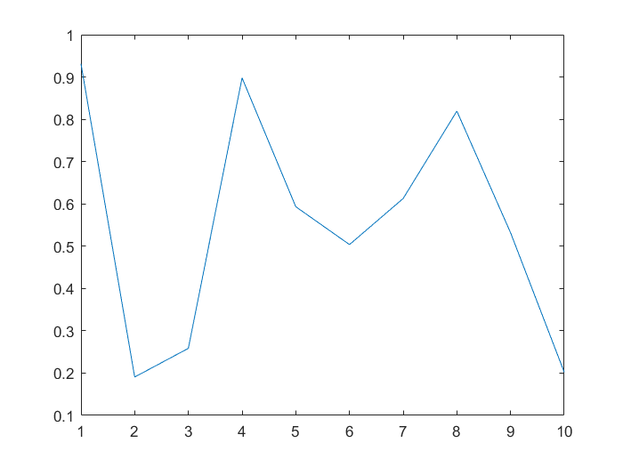
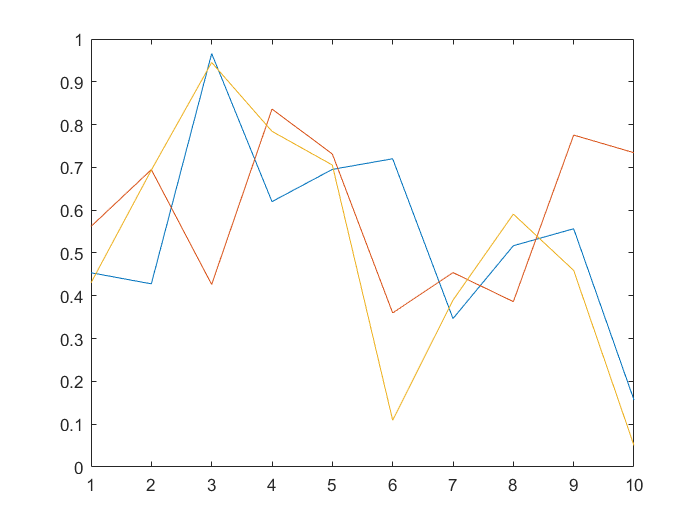
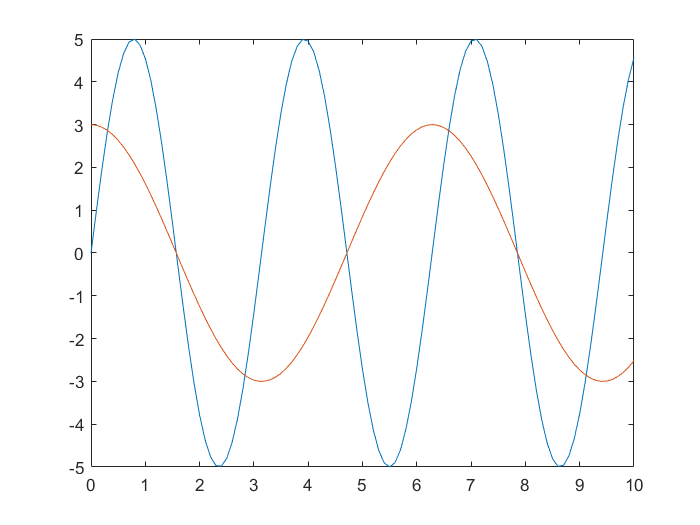
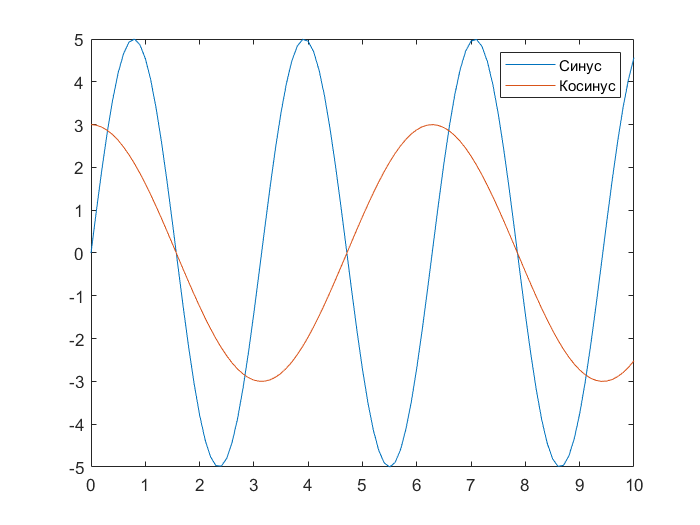
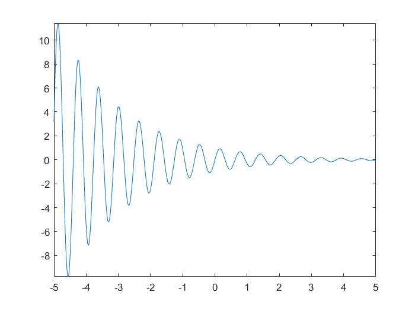
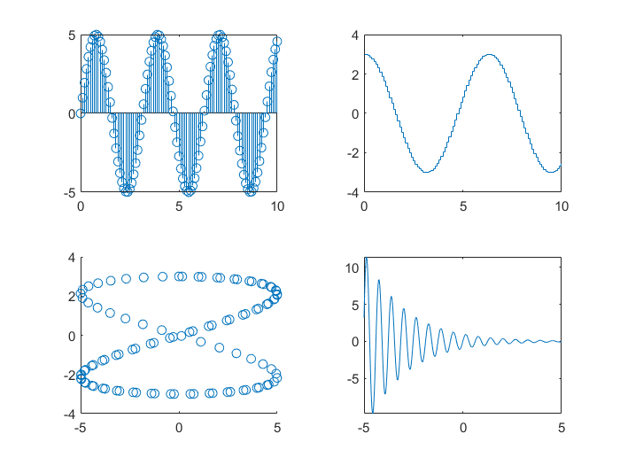
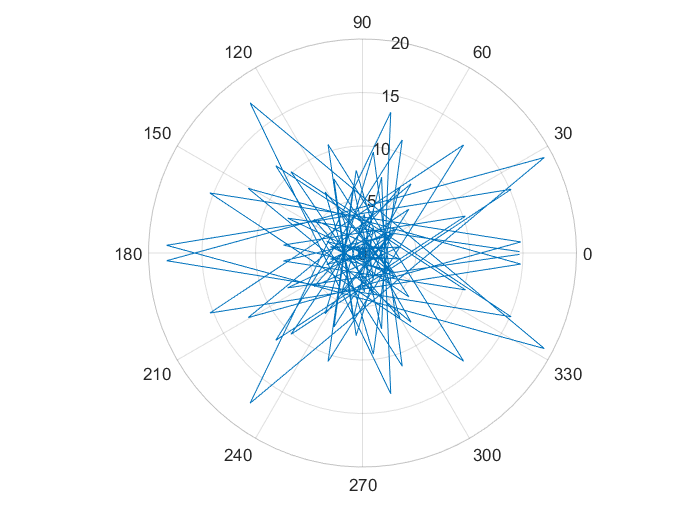
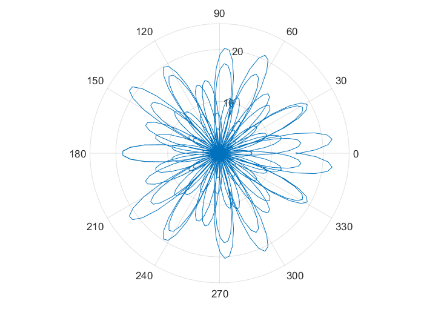

# Построение графиков

### Важно: рекомендуем посмотреть пример в [PDF](basic_plot.pdf), а также изучить [материалы](#дополнительно)

**Основные возможности по построению графиков**

Визуализация вектора

```matlab:Code
figure % создаем новую фигуру для построения в ней графика
a1 = rand(10,1);
plot(a1);
```



Визуализация матрицы

```matlab:Code
a2 = rand(10, 3);
plot(a2) % каждая линия графика - это столбец матрицы
```



Построение синусоиды во времени

```matlab:Code
figure
t = 0:0.1:10; % от 0 до 10 секунд с шагом 0,1 секунда
s = 5 * sin(2 * t); % вычисляем синус
plot(t, s)
```

Добавление нового графика к уже построенному

```matlab:Code
c = 3 * cos(t); % вычисляем косинус
hold on; % "задерживаем" оси для построения
plot(t, c)
hold off % "отпускаем" оси
```



Построение сразу нескольких графиков в одних осях

```matlab:Code
figure
plot(t, s, t, c)
legend(["Синус", "Косинус"]) % включение легенды
```



Построение графика функции

```matlab:Code
figure
fcn = @(x) exp(-0.5*x) .* sin(10*x); % векторизованная анонимная функция
fplot(fcn)
```



Построение нескольких графиков в одной фигуре

```matlab:Code
figure
tiledlayout('flow')
nexttile
stem(t, s)
nexttile
stairs(t, c)
nexttile
scatter(s, c)
nexttile
fplot(fcn)
```



График в полярных координатах

```matlab:Code
figure
t = linspace(-22, 22, 100); % график будет содержать 100 точек
p = t .* sin(50 * t / 8);
polarplot(t, p)
```



Увеличение детализации

```matlab:Code
figure
t = linspace(-22, 22, 1000); % график будет содержать 1000 точек
p = t .* sin(50 * t / 8);
polarplot(t, p)
```



# Дополнительно

[Больше примеров с построением графиков](https://docs.exponenta.ru/matlab/examples.html?category=graphics#graphics) [[english](https://www.mathworks.com/help/matlab/examples.html?category=graphics)]

[Подробнее о построении графиков в MATLAB](https://docs.exponenta.ru/matlab/graphics.html) [[english](https://www.mathworks.com/help/matlab/graphics.html)]

[Интерактивное построение графиков (видео)](https://youtu.be/J_hGJ7wYCr4)

[Библиотека графиков от MathWorks](https://www.mathworks.com/products/matlab/plot-gallery.html)