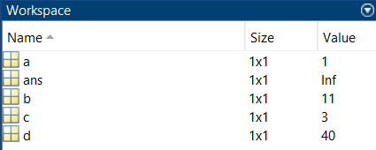

# Математические операции в MATLAB

### Важно: рекомендуем посмотреть пример в [PDF](math_operations.pdf), а также изучить [дополнительные материалы](#дополнительно)

**Обзор базовых возможностей MATLAB по выполнению математических расчетов**

Создаем переменные, присваивая им значения

```matlab:Code
a = 1
```

```text:Output
a = 1
```

```matlab:Code
b = 11
```

```text:Output
b = 11
```

Чтобы не выводить результат присвоения, поставим в конце `;` (на расчет это не влияет)

```matlab:Code
c = 1 + 2;
```

Математические операции в MATLAB выглядят абсолютно привычно

```matlab:Code
d = (a + b) / c * 10
```

```text:Output
d = 40
```

Но в MATLAB можно делить на ноль

```matlab:Code
d / 0
```

```text:Output
ans = Inf
```

Поскольку результат последней операции мы не записывали ни в какую переменную, то он автоматически записался в переменную `ans`. Ее тоже можно использовать для расчетов, но делать это не рекомендуется, потому что эту переменную вы можете случайно изменить в процессе расчетов

```matlab:Code
ans + 1
```

```text:Output
ans = Inf
```

Все созданные переменные хранятся в поле **Workspace** главного окна MATLAB



Если вы закончили расчет и созданные переменные больше не нужны, вы можете их удалить:

```matlab:Code
clear
```

# Дополнительно

[Больше математических примеров](https://docs.exponenta.ru/matlab/examples.html?category=elementary-math#elementary-math) [[оригинал](https://www.mathworks.com/help/matlab/examples.html?category=elementary-math)]

[Подробнее об элементарной математике в MATLAB](https://docs.exponenta.ru/matlab/elementary-math.html) [[оригинал](https://docs.exponenta.ru/matlab/elementary-math.html)]

[Введение в MATLAB (видео)](https://www.youtube.com/playlist?list=PLmu_y3-DV2_nKd7epECPEbTVamsmEmMMI)