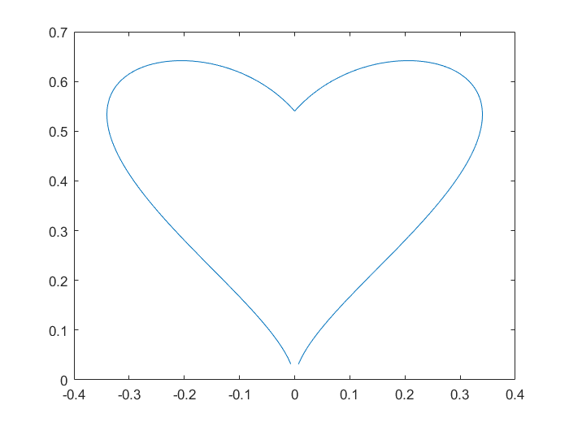

# Математические функции в MATLAB

### Важно: рекомендуем посмотреть пример в [PDF](math_functions.pdf), а также изучить [дополнительные материалы](#дополнительно)

**Использование базовых математических функций для скаляров и матриц**

В MATLAB встроены все необходимые математические функции, которые могут понадобиться вам для расчетов

Например, решим квадратное уравнение  

```matlab:Code
D = 4 * (3^2 - 5); % дискриминант
x1 = (-3 + sqrt(D) / 2) / 1 % первое решение
```

```text:Output
x1 = -1
```

```matlab:Code
x2 = (-3 - sqrt(D) / 2) / 1 % второе решение
```

```text:Output
x2 = -5
```

Или нарисуем сердечко

```matlab:Code
t = -1 : 0.001 : 1; % создаем вектор
x = sin(t) .* cos(t) .* log(abs(t));
y = sqrt(abs(t)) .* cos(t);
plot(x, y) % строим график
```



# Дополнительно

[Больше примеров с математическими функциями](https://docs.exponenta.ru/matlab/examples.html?category=mathematics#mathematics) [[оригинал](https://www.mathworks.com/help/matlab/examples.html?category=mathematics)]

[Подробнее о математических функциях в MATLAB](https://docs.exponenta.ru/matlab/mathematics.html) [[оригинал](https://www.mathworks.com/help/matlab/mathematics.html)]

[Массивы и матрицы (видео)](https://youtu.be/7AsTymGlWo4)