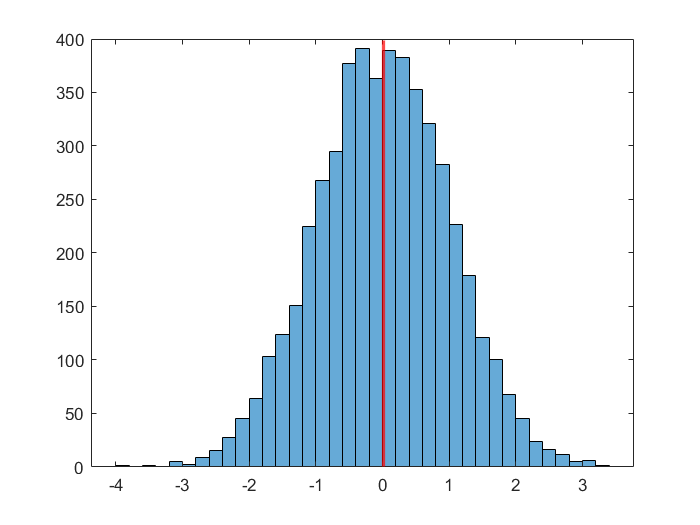

# Базовая статистика

### Важно: рекомендуем смотреть пример в [PDF](basic_statistics.pdf)

**Основные статистические операции в MATLAB**

Создадим матрицу случайных чисел (1000 строк, 5 столбцов)

```matlab:Code
r1 = randn(1000, 5);
```

Найдем среднее значение в каждом столбце матрицы

```matlab:Code
m1 = mean(r1)
```

```text:Output
m1 = 1x5    
   -0.0033   -0.0055    0.0242    0.0222    0.0263

```

Найдем стандартное отклонение в каждом столбце матрицы

```matlab:Code
s1 = std(r1)
```

```text:Output
s1 = 1x5    
    0.9550    1.0119    1.0191    0.9684    1.0093

```

Найдем медианное значение во всей матрице

```matlab:Code
m2 = median(r1, 'all')
```

```text:Output
m2 = 0.0190
```

Потсроим гистограмму распределения

```matlab:Code
histogram(r1)
```

Добавим на гистограмму медианное значение

```matlab:Code
hold on
xline(m2, 'red', 'LineWidth', 2)
hold off
```

