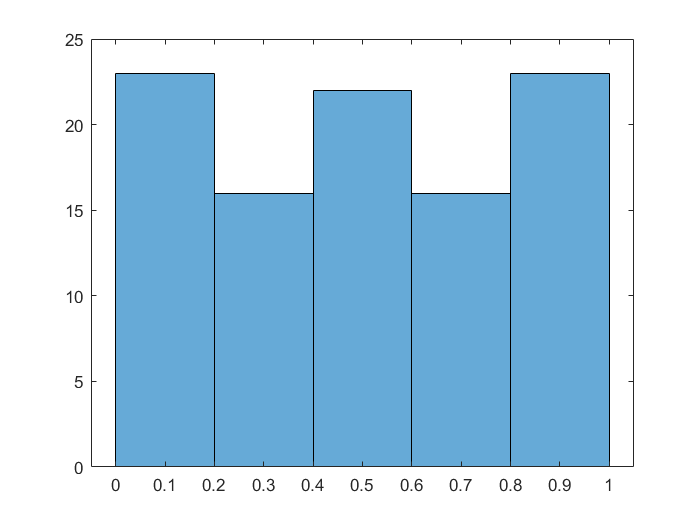
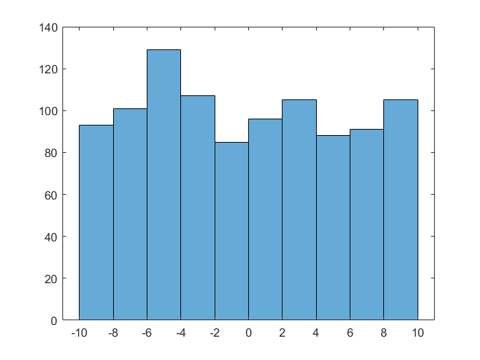
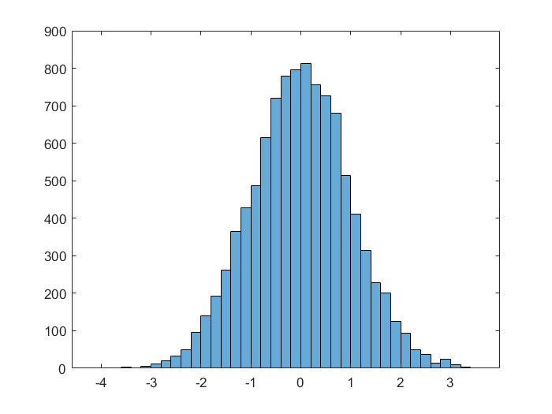
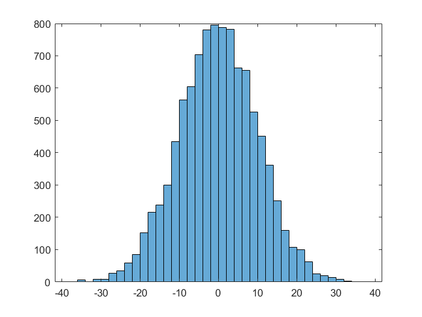
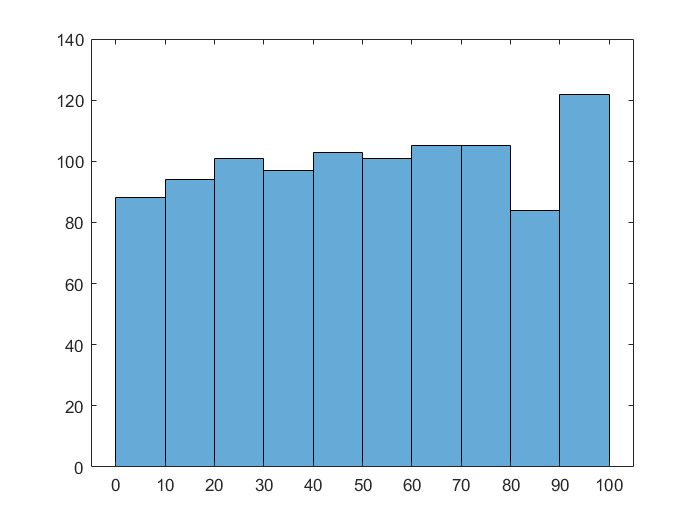

# Случайные числа

**Генерация случайных чисел и исследование распределения**

Случайное число от 0 до 1

```matlab:Code
r1 = rand
```

```text:Output
n1 = 0.7359
```

Вектор-столбец из 100 случайных чисел, равномерно распределенных в диапазоне от 0 до 1

```matlab:Code
u2 = rand(100, 1);
histogram(u2); % посторение гистограммы для визуализации
```



Вектор-строка из 1000 случайных чисел, равномерно распределенных в диапазоне от -10 до 10

```matlab:Code
u3 = rand(1, 1000) * 20 - 10;
histogram(u3);
```



Нормально распределенные числа (среднее значение 0, стандартное отклонение 1)

```matlab:Code
n1 = randn(10000, 1);
histogram(n1)
```



Квадратная матрица нормально распределенных чисел размерностью 100х100 (стнадартное отклонение 10)

```matlab:Code
n2 = randn(100) * 10;
histogram(n2)
```



Случайное целое число от 1 до 10

```matlab:Code
i1 = randi(10)
```

```text:Output
i1 = 7
```

Случайное целое число от -10 до 10

```matlab:Code
i2 = randi(21) - 11
```

```text:Output
i2 = -5
```

Матрица случайных целых чисел от 1 до 100 размерностью 100х10

```matlab:Code
i3 = randi(100, 100, 10);
histogram(i3)
```

